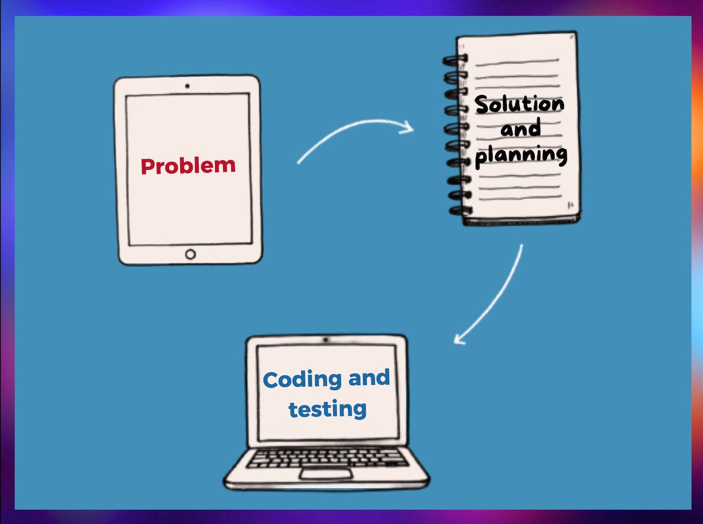
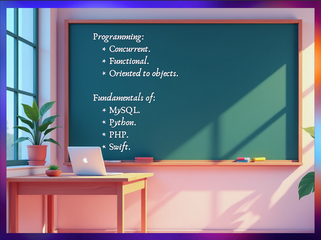
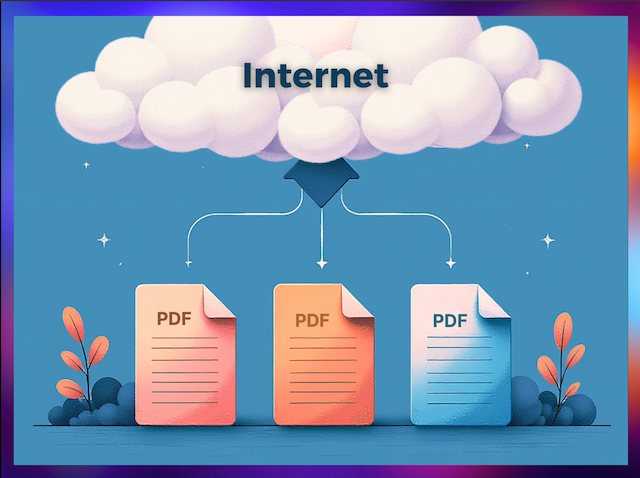

    <h1>Hola, soy David Guerrero </h1>

 
 

<h2> Sobre Mi</h2>
    

    Ingeniero en Sistemas apasionado por el desarrollo de software backend, con un fuerte enfoque en la resolución de problemas y la implementación de soluciones eficientes. Me caracterizo por aplicar buenas prácticas en cada proyecto y poseo una sólida capacidad de liderazgo. Trabajo de manera autónoma, con un enfoque constante en la mejora continua.
    

 
 

<h2> Stack Tecnológico</h2>

    

 
 

<h2> Proyectos Destacados</h2>
<table>
    <tr>
        <td width="50%">
             
            <h3 align="center">Desafíos de Programación</h3>
            

                
                 
                

                    <a href="https://github.com/D4v1d123/Programming-challenges.git">Resolución de problemas de programación</a>
                    utilizando conceptos clave estudiados como la asincronía, recursividad, y los paradigmas funcional, y orientado a objetos.
                

            

             
             
        </td> 
        <td width="50%">
             
            <h3 align="center">Revisión de Archivos en Hoja de Cálculo</h3>
            
                                       
                
                 
                

                    <a href="https://bosabe.com/wp-content/uploads/2017/07/coming-soon.jpg">Verificación rápida y eficiente de la existencia de resultados médicos dentro la trazabilidad u hoja de cálculo</a>,
                    resaltando las celdas de los usuarios que tienen su archivo correspondiente en la carpeta. Esto asegura que todos los documentos necesarios estén presentes y correctamente registrados.
                

            
 
        </td> 
    </tr>
    <tr>
        <td width="50%">
             
            <h3 align="center">Guia Completa de Conceptos Clave de Programación</h3>
            

                
                 
                

                    Introducción a temas clave en programación, incluyendo 
                    <a href="https://github.com/D4v1d123/Concurrent-programing.git">programación concurrente</a>, 
                    <a href="https://github.com/D4v1d123/Functional-paradigm.git">funcional</a> y 
                    <a href="https://github.com/D4v1d123/Object-oriented-programming-paradigm.git">orientada a objetos</a>. 
                    Agregado a esto, se proporciona una base sólida en herramientas como 
                    <a href="https://github.com/D4v1d123/SQL-fundamentals.git">MySQL</a>, 
                    <a href="https://github.com/D4v1d123/Python-programming-fundamentals.git">Python</a>, 
                    <a href="https://github.com/D4v1d123/PHP-programming-fundamentals.git">PHP</a> y 
                    <a href="https://github.com/D4v1d123/Linear-data-structure.git">Swift</a>. 
                    Esto facilita el aprendizaje y la comprensión de conceptos fundamentales.
                

            

             
             
        </td>       
        <td width="50%">
             
            <h3 align="center">Subir Archivos al Historial Clínico en Internet</h3>
            

                
                 
                

                    <a href="https://github.com/D4v1d123/Upload-files-Salud.SIS.git">Subida semiautomática de archivos a una plataforma de historia clínica en línea</a>,
                    optimizando el proceso al reducir el tiempo necesario para cargar documentos y capturar errores en los archivos de los usuarios. Esta herramienta utiliza técnicas de coincidencia de imágenes, manejo de directorios, extracción y ordenamiento de datos.
                

            

             
        </td> 
    </tr> 
</table>                                                                                 
 
 

<h2> Conecta Conmigo</h2>

    
    
    
    

